# Doxygen
## Generador de documentación
Doxygen es una herramienta generadora de documentación que se utiliza principalmente para documentar el código fuente del software. Se usa comúnmente en la industria del desarrollo de software para generar automáticamente documentación de alta calidad en varios formatos, como HTML, PDF y RTF, a partir de comentarios con formato especial dentro del código fuente.

## Generacion de documentacion de un proyecto de Java
### Antes de empezar 
Para poder visualizar todos los comentarios en Doxygen, es importante generar la documentacion en Java
>Los comentarios deben estar detallados para que se visualicen correctamente

### Configuración de parámetros en Doxygen

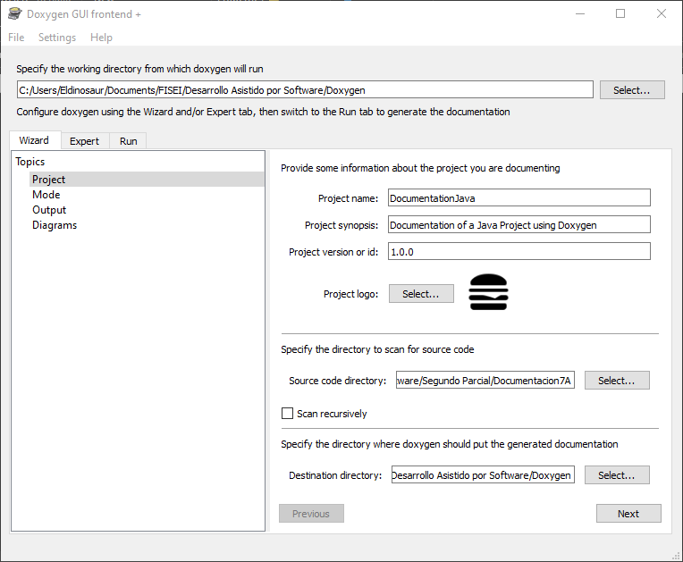

- Debemos seleccionar la carpeta en donde queremos que Doxygen se ejecute
- Proporcionaremos informacion acerca del proyecto 
- >Debe incluirse nombre, un resumen de que trata el proyecto, la version del proyecto y un logo
- Especificamos la ruta de la carpeta en donde se encuentran nuestras clases en Java
- >Hay que especificar la ruta exacta donde estan las clases, no la del proyecto en general, sino la documentacion no se generará
- Especificamos la ruta de la carpeta en donde se generara la documentacion
- >En esta carpeta se generarán los archivos que luego podremos visualizar en el navegador

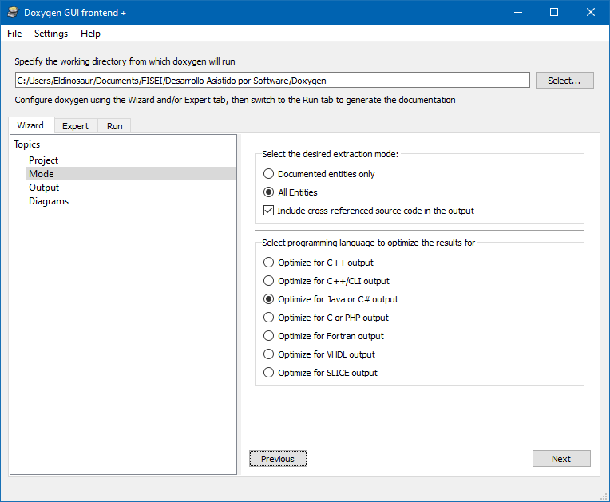
- Seleccionamos el tipo de extraccion de la documentacion 
- >Incluimos que exista referencia cruzada
- Seleccionamos el lenguaje de programacion que vamos a utilizar

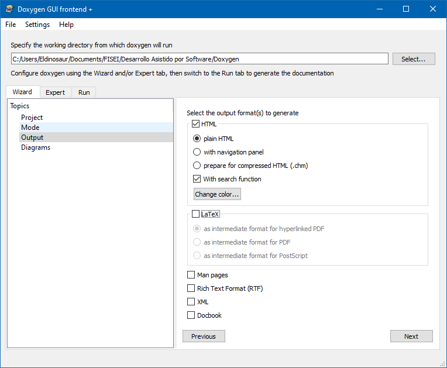
- Aqui seleccionamos el tipo de salida de la documentacion
- > En este caso seleccionamos HTML para poder visualizarlo desde cualquier navegador

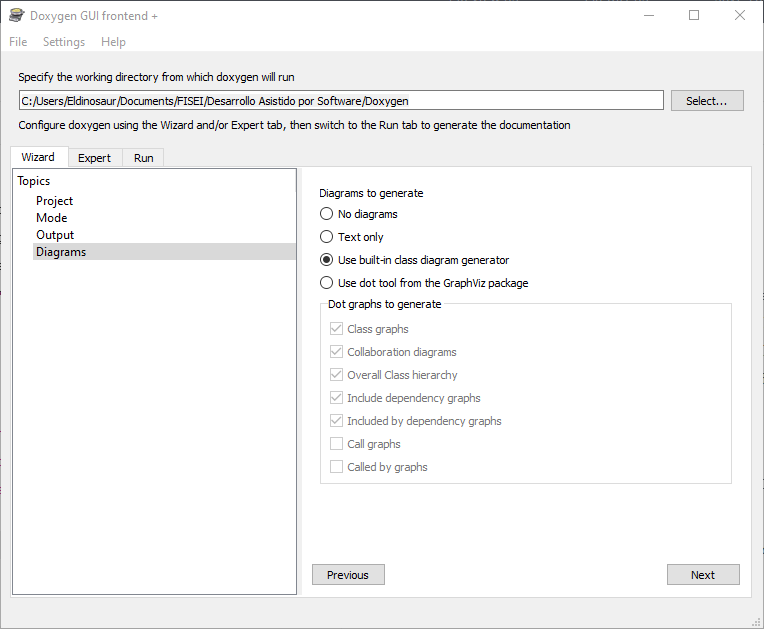
- Seleccionamos los diagramas a generar
- >Dejamos el que se marca por defecto que genera las clases que se encuentran en el proyecto

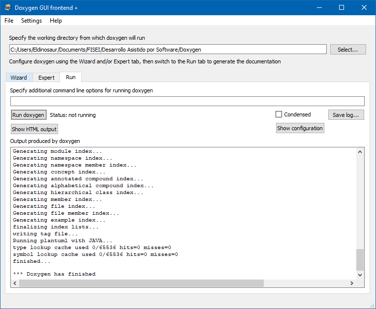
- Ejecutamos el programa y este generara los archivos necesarios para la documentacion y posterior visualizacion en cualquier navegador
- >Este proceso no toma mucho tiempo

### Visualizacion de la documentacion generada
Una vez que Doxygen termino de generar los archivos necesarios, vamos a visualizarlos.
En la carpeta que designamos para Doxygen, se habrá generado una carpeta llamada html en donde estaran los archivos generados por Doxygen

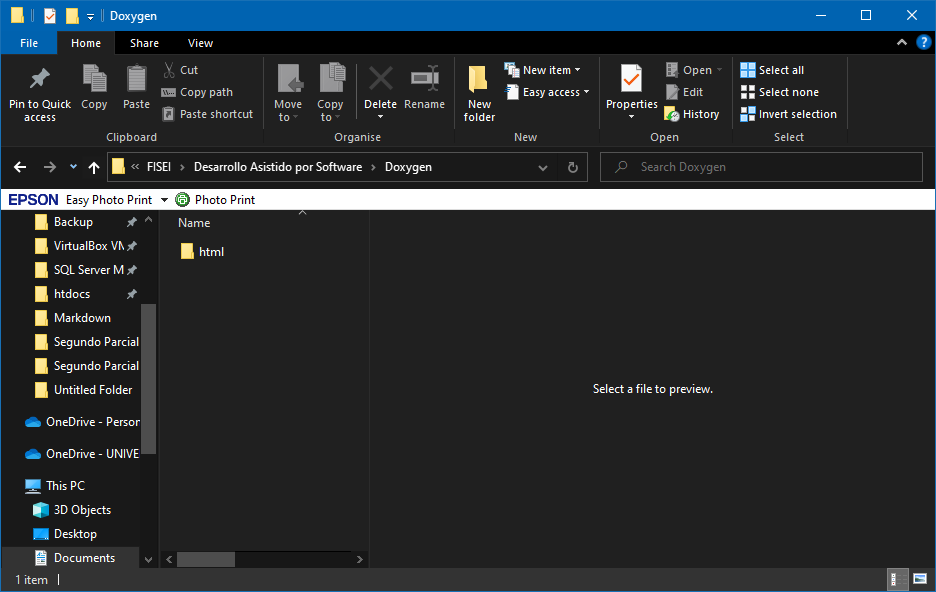

Aqui buscaremos el archivo ```index.html``` y lo abrimos en cualquier navegador.

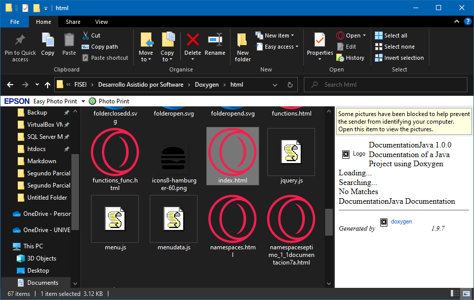

Este mostrará en el navegador la pagina principal de la documentación generada con Doxygen

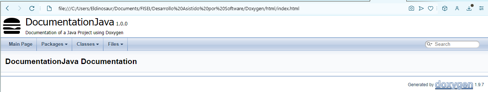

Se mostrará en la pestaña de Classes todas las clases del proyecto

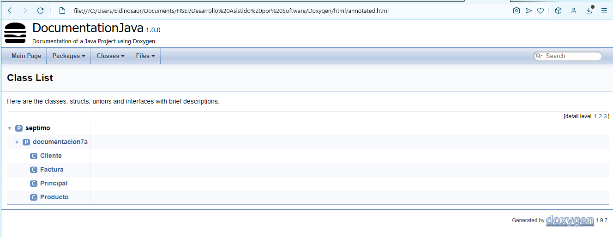

#### Clase Cliente

```
package septimo.documentacion7a;

/**
 * Esta clase contiene atributos para el cliente
 * 
 * @author Eldinosaur
 */

public class Cliente {
    String nombre;
    String apellido;
    char genero;
    int edad; 
}
```
Este segmento de codigo se mostrará en el navegador asi:

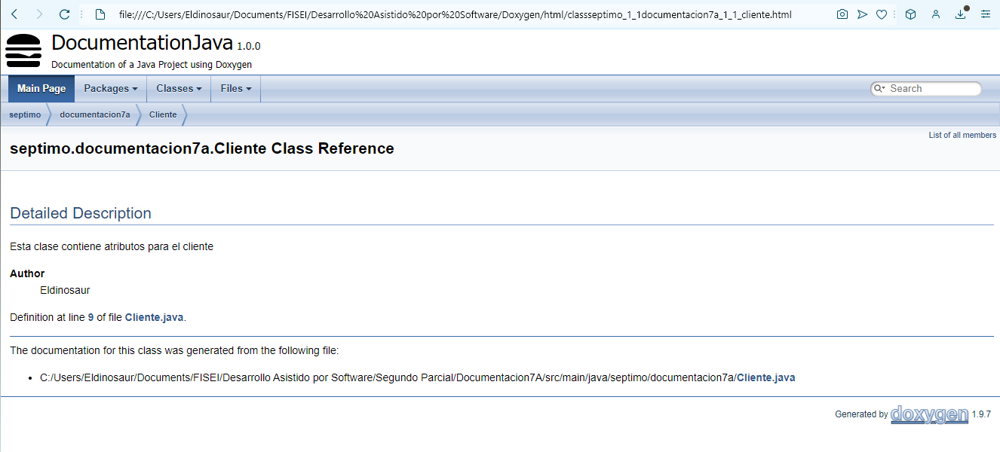

### Clase Factura

```
package septimo.documentacion7a;

/**
 * Representa una factura de compra
 * 
 * almacena la fecha de compra y forma de pago asociadas a la factura.
 * incluye metodos para calcular el valor total de la factura
 * 
 * @author Eldinosaur
 */

public class Factura {
    /**
     * la fecha de compra de la factura
     */
    String fecha_compra;
    /**
     * la forma de pago utilizada para la factura
     */
    String forma_pago;
    
/**
 * constructor de la clase
 * 
 * @param fecha_compra la fecha de compra
 * @param forma_pago la forma de pago utilizada para la factura
 */
    public Factura(String fecha_compra, String forma_pago) {
        this.fecha_compra = fecha_compra;
        this.forma_pago = forma_pago;
    }
    /**
     * 
     * @param cantidad la cantidad de articulos en la factura
     * @param valor el valor unitario de cada articulo
     * @param descuento el descuento aplicado a cada articulo
     * @return  el valor total de la factura
     */
    
    
    public double valor_total (int cantidad, double valor, double descuento){
        return (valor-(valor*descuento))*cantidad;
    }
    /**
     * Calcula el valor total de la factura teniendo en cuenta la cantidad y el valor unitario de los artículos, sin aplicar descuento.
     * 
     * @param cantidad La cantidad de artículos en la factura.
     * @param valor El valor unitario de cada artículo.
     * @return El valor total de la factura.
     */
    
    public double valor_total (int cantidad, double valor){
        return valor*cantidad;
    }
    /**
     * Calcula el valor individual por artículo en la factura.
     * 
     * @param cantidad La cantidad de artículos en la factura.
     * @param valor El valor total de la factura.
     * @return El valor individual por artículo.
     * @throws ArithmeticException Si la cantidad es igual a cero (división por cero).
     */
    
    public double valor_individual (int cantidad, double valor) throws ArithmeticException{
        return valor/cantidad;
    }
}
```

Este segmento de codigo se mostrará así en el navegador:

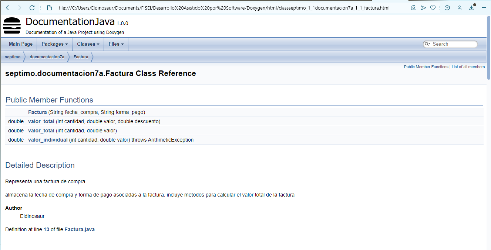

### Clase Producto

````
package septimo.documentacion7a;

/**
 * La clase Producto representa un producto con información básica.
 * 
 * Esta clase almacena el nombre del producto, la cantidad disponible, el valor unitario y el descuento aplicado (opcional).
 * 
 * @author Eldinosaur
 */

public class Producto {
    /**
     * El nombre del producto
     */
    String nombre;
    /**
     * La cantidad dispoible del producto
     */
    int cantidad; 
    /**
     * El valor unitario del producto
     */
    double valor;
    /**
     * el descuento aplicado al producto (opcional)
     */
    double descuento;
    

    /**
     * Constructor de la clase Producto con descuento.
     * 
     * @param nombre El nombre del producto.
     * @param cantidad La cantidad disponible del producto.
     * @param valor El valor unitario del producto.
     * @param descuento El descuento aplicado al producto.
     */
    public Producto(String nombre, int cantidad, double valor, double descuento) {
        this.nombre = nombre;
        this.cantidad = cantidad;
        this.valor = valor;
        this.descuento = descuento;
    }

    /**
     * Constructor de la clase Producto sin descuento.
     * 
     * @param nombre El nombre del producto.
     * @param cantidad La cantidad disponible del producto.
     * @param valor El valor unitario del producto.
     */
    public Producto(String nombre, int cantidad, double valor) {
        this.nombre = nombre;
        this.cantidad = cantidad;
        this.valor = valor;
    }
    
}
```

Este segmento de codigo se mostrara asi en el navegador:

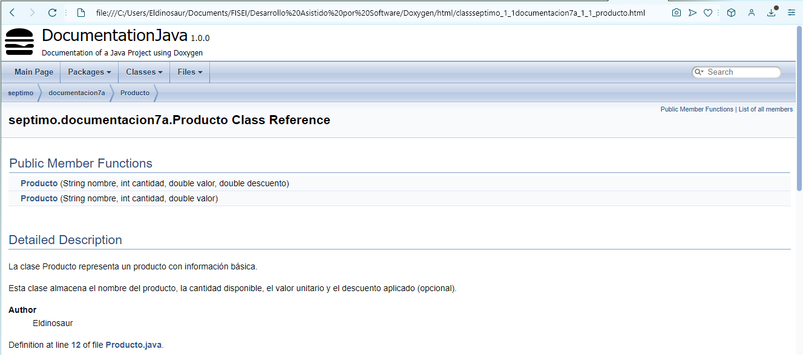

### Clase Principal

```
package septimo.documentacion7a;

/**
 * La clase Principal es la clase de inicio del programa.
 * 
 * Esta clase crea instancias de la clase Cliente, Producto y Factura,
 * y muestra información relacionada con la facturación de una compra.
 * 
 * @author Eldinosaur
 */

public class Principal {
    /**
     * El método main es el punto de entrada del programa.
     * 
     * @param args Los argumentos de línea de comandos (no se utilizan en este caso).
     */

    public static void main(String args[]) {
        Cliente cliente1 = new Cliente();
        
        cliente1.nombre = "Santiago";
        cliente1.apellido = "Jara";
        cliente1.genero = 'M';
        cliente1.edad = 29;
        
        Producto producto1 = new Producto("Agua", 2, 0.5);
        Producto producto2 = new Producto("Coca Cola", 5, 0.4, 0.05);
        
        Factura factura = new Factura("06-01-2021", "Efectivo");
        
        System.out.println("FACTURACIÓN DE COMPRA DE UN PRODUCTO");
        System.out.println("Fecha de compra: " + factura.fecha_compra);
        System.out.println("Forma de pago: " + factura.forma_pago);
        System.out.println("#########################################");
        System.out.println("Cliente: " + cliente1.nombre + " " + cliente1.apellido);
        System.out.println("Genero: " + cliente1.genero);
        System.out.println("Edad: " + cliente1.edad);
        System.out.println("#########################################");
        System.out.println("Producto: " + producto2.nombre);
        System.out.println("Cantidad: " + producto2.cantidad);
        System.out.println("Valor: " + producto2.valor);
        System.out.println("Descuento: " + producto2.descuento);
        System.out.println("#########################################");
        System.out.println("El valor total es: " + factura.valor_total(producto2.cantidad, producto2.valor, producto2.descuento));
        
                
    }
}
```

Este segmento de codigo se mostrará así en el navegador

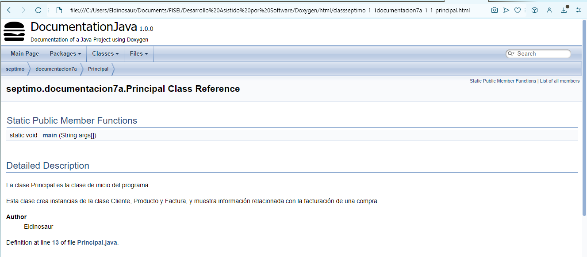

